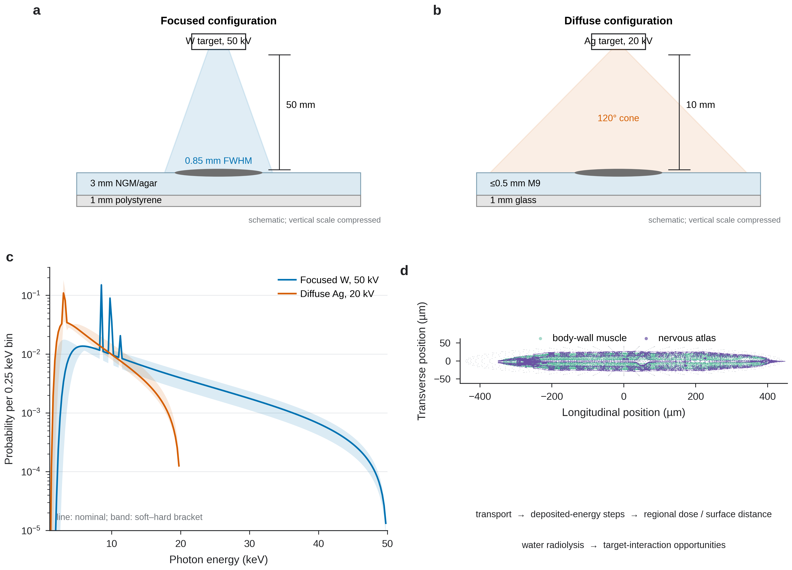
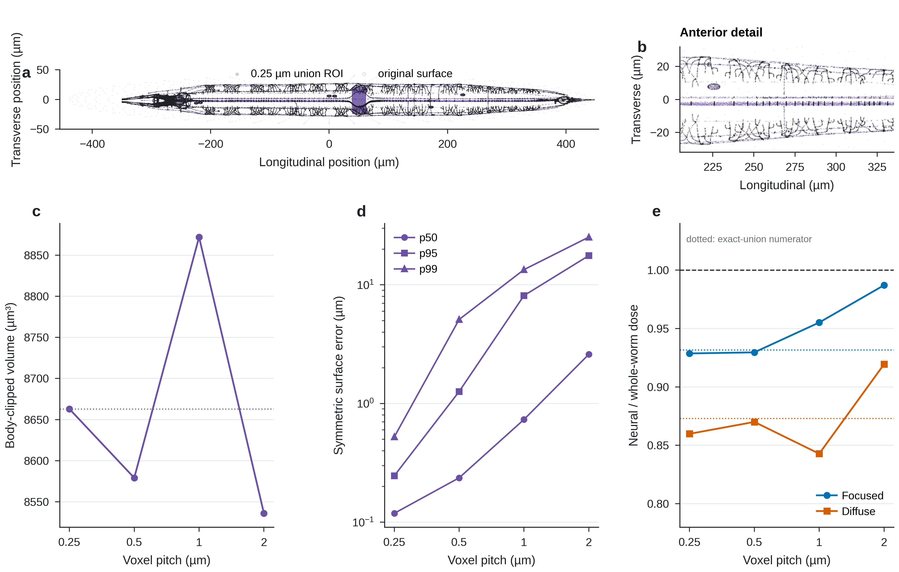
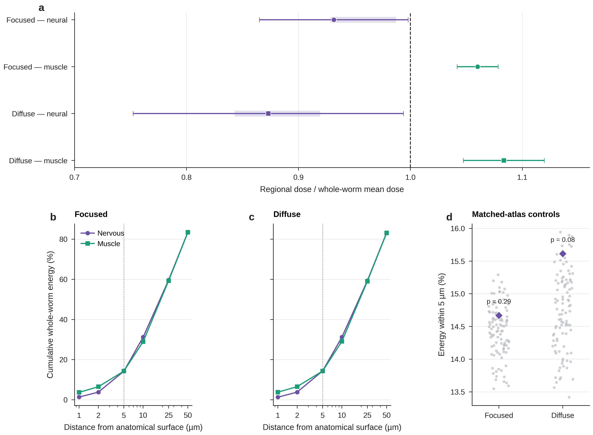
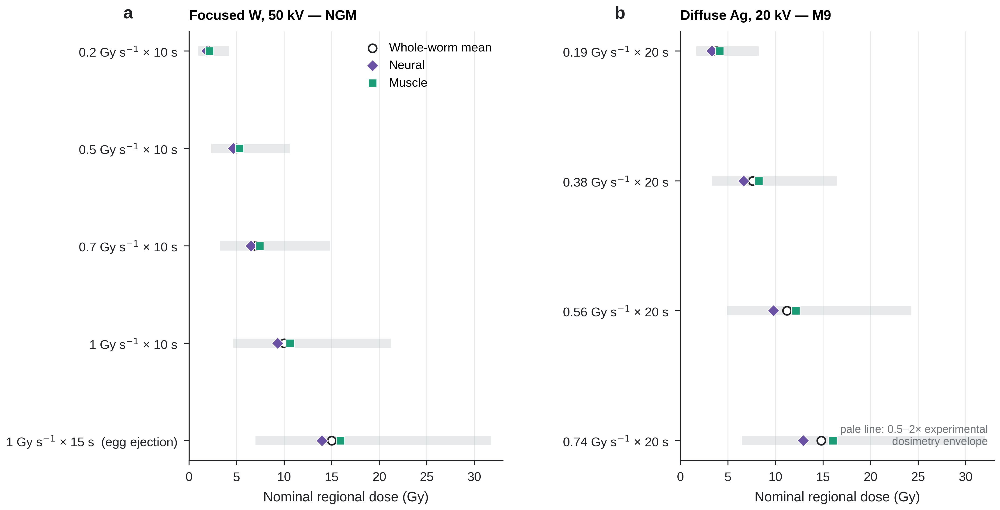
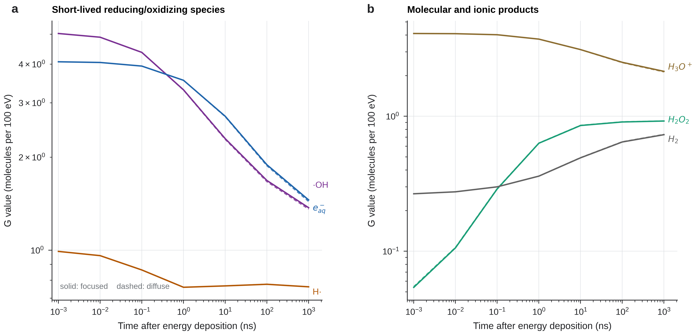
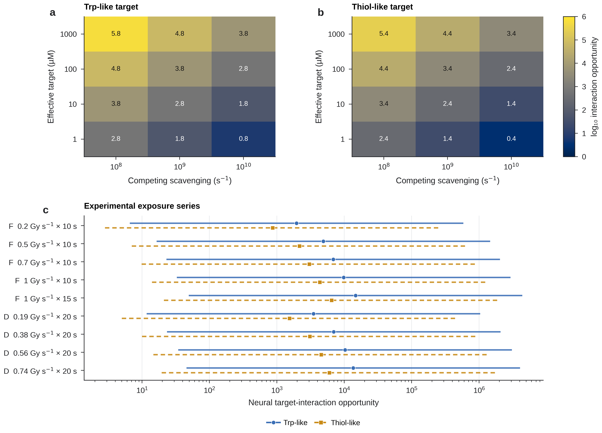

# Anatomy-resolved X-ray dosimetry and water radiolysis during LITE-1-dependent stimulation in *Caenorhabditis elegans*

## Abstract

X-rays have been shown to evoke rapid behavioral responses in *Caenorhabditis elegans* that depend on the photoreceptor LITE-1. Indeed, ectopic expression of LITE-1 in body-wall muscle is sufficient to confer X-ray sensitivity to that tissue. However, the radiochemical events linking X-ray absorption to LITE-1-expressing cells have not been quantified. We developed an anatomy-resolved Monte Carlo model of the focused and diffuse X-ray conditions reported by Cannon et al. and used it to calculate regional absorbed-dose estimates, spatial energy deposition, and water-radiolysis yields in the nervous system and body-wall muscle. Focused irradiation was modeled as a 50 kV tungsten source with a 0.85 mm beam footprint over an NGM/agar substrate, and diffuse irradiation as a 20 kV silver source over an M9/glass preparation. Geant4 transport was performed with OpenWorm-derived anatomy, and an analysis-only neural mean dose was scored using the union of 276 closed nervous-system objects reconstructed independently of the transport geometry. Two 100-million-history simulations gave neural-to-whole-worm mean-dose ratios of 0.932 (95% Monte Carlo confidence interval, 0.865–0.998) for focused irradiation and 0.873 (0.752–0.994) for diffuse irradiation. Corresponding body-wall-muscle ratios were 1.060 (1.042–1.078) and 1.083 (1.047–1.120). Approximately 14.2–14.4% of total deposited energy occurred within 5 µm of the nervous-system surface, similar to the fraction near the muscle surface. Geant4-DNA calculations based on local deposited-energy-weighted electron spectra predicted hydroxyl radicals, hydrated electrons, hydrogen radicals, hydrogen peroxide, and other water-radiolysis products beginning on picosecond timescales. For a nominal 2 Gy focused exposure, neural energy deposition corresponded to approximately 1.44×10^6 hydroxyl-radical and 9.65×10^5 hydrogen-peroxide molecules in pure-water-equivalent yield at approximately 1 µs. Published reaction kinetics further place tryptophan- and thiol-containing targets within a chemically accessible regime for hydroxyl-radical reactions. These results are consistent with a model in which X-ray irradiation provides a rapid radiophysical and radiochemical stimulus throughout exposed tissues, while tissue-specific LITE-1 expression confers cellular sensitivity. The calculations provide quantitative predictions for experiments that directly perturb radical chemistry, redox signaling, and LITE-1 function during X-ray stimulation.

## Background

The ability to control electrically active cells with genetic specificity has transformed experimental neuroscience. Optogenetics achieves this by coupling cell-specific expression of light-sensitive proteins to external illumination, but light delivery becomes progressively more difficult with tissue depth and often requires implanted fibers or other optical hardware. X-rays offer a distinct physical route because they penetrate tissue far more efficiently than visible or ultraviolet light. This has motivated several approaches to X-ray neuromodulation, including the use of radioluminescent particles to convert X-ray energy into visible photons capable of activating conventional opsins. Bartley et al., for example, showed that X-ray-excited cerium-doped lutetium oxyorthosilicate could activate light-sensitive proteins and increase synaptic activity in neuronal preparations [3]. A separate possibility is that a genetically encoded protein could itself confer sensitivity to the physical or chemical products of X-ray absorption.

Reports that animals can perceive ionizing radiation long predate modern neuromodulation. Behavioral arousal, radiotaxis, visual sensations, and other acute responses to X-rays have been described across multiple species, although the relevant sensory mechanisms have often remained uncertain [2]. *C. elegans* is particularly attractive for resolving such mechanisms because its nervous system is compact and highly stereotyped. The adult hermaphrodite has 302 neurons arranged in an essentially invariant architecture, with longitudinal and circumferential process bundles distributed through a body approximately a millimeter in length [10]. This anatomical regularity, together with extensive genetic tools and detailed digital reconstructions, makes the worm well suited for connecting radiation transport to specific tissues and molecular pathways.

Cannon et al. recently established a direct genetic link between X-ray stimulation and the unusual *C. elegans* photoreceptor LITE-1 [1]. In their focused-beam experiments, individual adult worms on NGM agar were positioned within a 0.85 mm full-width-at-half-maximum X-ray spot produced by a tungsten-target iMOXS-MFR source operated at 50 kV. A 10 s exposure elicited a rapid locomotory avoidance response in wild-type animals. The response was preserved in *gur-3* mutants but was strongly impaired in *lite-1* mutants and *lite-1; gur-3* double mutants, identifying LITE-1 as the major genetic requirement for the avoidance behavior. The response could begin within approximately two seconds of irradiation at the highest dose rate, corresponding to a cumulative dose on the order of only a few gray at response onset [1].

The same study provided a particularly important sufficiency experiment. When LITE-1 was expressed ectopically in body-wall muscle under the *myo-3* promoter, X-ray exposure produced muscle contraction and paralysis. In a diffuse swimming assay, a 20 kV silver-target Amptek Mini-X source delivered dose rates of approximately 0.19, 0.38, 0.56, and 0.74 Gy s^-1 for 20 s. Paralysis increased with dose rate in *pmyo-3::lite-1* animals, whereas wild-type locomotion changed little at the highest exposure. Focused 50 kV irradiation at approximately 1 Gy s^-1 for 15 s likewise induced paralysis and caused egg ejection in five of ten *pmyo-3::lite-1* animals and none of ten wild-type animals [1]. These results show that LITE-1 expression can render a tissue X-ray responsive without requiring that tissue to possess a specialized macroscopic radiation-absorption property.

LITE-1 is itself an unusual receptor. It belongs to the invertebrate gustatory receptor family but functions as a bona fide photoreceptor. Purified LITE-1 absorbs ultraviolet radiation with an exceptionally high extinction coefficient, and mutational studies identified two tryptophan residues, W77 and W328, as essential for ultraviolet sensitivity. Substitution of either residue nearly abolished ultraviolet-evoked calcium responses when LITE-1 was expressed in muscle [4]. More recent structural and electrophysiological work supports a model in which LITE-1 forms a light-activated ion channel and contains an aromatic network, a putative chromophore-binding pocket, and redox-sensitive cysteine residues that may participate in channel regulation [8].

The physics of X-ray absorption makes direct extension of the ultraviolet mechanism unlikely. At diagnostic X-ray energies, interaction probability is governed primarily by atomic composition and photon energy rather than the electronic transitions that give aromatic residues their ultraviolet absorbance. Cannon et al. estimated that, for a ~50 kDa LITE-1 molecule, only about one receptor in 50 million would directly absorb an X-ray photon per gray [1]. Given the rapid behavioral response and low endogenous abundance of LITE-1, they proposed that secondary electrons and radiation chemistry were more plausible intermediates. X-ray energy absorbed in water-rich tissue is transferred largely to energetic electrons, which then produce dense sequences of ionization and excitation events as they slow. The resulting radiolysis of water generates hydroxyl radicals (·OH), hydrated electrons (e^-_aq), hydrogen radicals (H·), hydrogen peroxide (H2O2), molecular hydrogen, and other reactive products over femtosecond-to-microsecond timescales [13–15].

Several independent observations make this chemistry relevant to LITE-1. Bhatla and Horvitz showed that LITE-1 and its paralog GUR-3 participate in behavioral responses to hydrogen peroxide; GUR-3-dependent H2O2 sensing in pharyngeal I2 neurons requires the peroxiredoxin PRDX-2 [5]. Quintin et al. later found that PHA tail neurons can sense micromolar H2O2 through LITE-1 and PRDX-2 and proposed a peroxiredoxin-mediated redox relay involving conserved receptor cysteines [9]. Bischer et al. showed that internally generated reactive oxygen species can drive LITE-1-dependent avoidance independently of blue-light color perception and identified Cys44 as important for ROS-dependent behavior [7]. At the same time, oxidative regulation is not uniformly activating: Zhang et al. found that H2O2 suppresses LITE-1-dependent phototaxis and neuronal photoresponses and proposed that oxidation participates in receptor deactivation and recovery [6]. Hanson et al. likewise identified redox-sensitive structural features and proposed that photon absorption and oxidation can cooperate in LITE-1 gating [8]. Together, these studies place LITE-1 within a redox-sensitive signaling environment in which the identity, timing, and local concentration of reactive species are likely to matter.

The earliest radiolytic products are also chemically capable of reacting with residues implicated in LITE-1 function. Pulse radiolysis measurements give a second-order rate constant of approximately 1.25×10^10 M^-1 s^-1 for ·OH reaction with free tryptophan, with hydroxyl addition occurring largely at the indole ring [17]. The corresponding ·OH reaction with cysteine is approximately 5.35×10^9 M^-1 s^-1 [18]. Peroxiredoxins react rapidly with H2O2; representative thioredoxin peroxidases have measured rate constants near 10^7 M^-1 s^-1 at physiological pH, with the broader peroxiredoxin family spanning a substantial kinetic range [19]. These rates do not specify how LITE-1 responds to any individual chemical event, but they establish that the relevant molecular motifs are kinetically accessible to radiation-generated oxidants and radicals.

A quantitative test of the radiolysis hypothesis therefore requires more than whole-animal dose. It requires knowledge of where X-ray energy is deposited relative to the nervous system and muscle, whether the regional doses are large enough to support substantial local radiation chemistry, and whether the chemical products arise on timescales compatible with the observed behavior. OpenWorm provides a framework for this analysis by combining three-dimensional anatomical resources with computational models of the worm [11]. The present study integrates OpenWorm-derived anatomy with Geant4 radiation transport [12] and Geant4-DNA water chemistry [13–15] to reconstruct the physical and early chemical environment produced by the Cannon/Bolding X-ray exposures. We calculate absorbed dose in nervous and muscle tissue, resolve deposited energy as a function of distance from neural anatomy, propagate local electron spectra into water-radiolysis simulations, and compare the resulting chemistry with known LITE-1-relevant reaction pathways.

**Figure 1. Experimental configurations, source models, and computational framework.** **a**, Focused 50 kV tungsten configuration with a 0.85 mm FWHM footprint over the NGM/agar and polystyrene preparation. **b**, Diffuse 20 kV silver configuration with a 120° emission cone over the M9 and glass preparation. Vertical dimensions are compressed in both technical schematics. **c**, Nominal photon-energy probability distributions (lines) and soft-to-hard spectral brackets (bands). **d**, OpenWorm-derived body-wall-muscle and nervous-system anatomy used for regional and surface-referenced analysis.

## Methods

### Experimental irradiation conditions represented in the model

The model was based on the focused avoidance, focused muscle/egg-ejection, and diffuse muscle-paralysis experiments reported by Cannon et al. [1]. Table 1 summarizes the experimental conditions used for model normalization.

| Experimental condition | Source | Tube voltage | Irradiation geometry | Reported dose rate | Exposure |
|---|---|---:|---|---:|---:|
| Focused avoidance | iMOXS-MFR, W target | 50 kV | ~0.85 mm FWHM focused spot on NGM agar | ~0.2, 0.5, 0.7, 1.0 Gy s^-1 | 10 s |
| Focused muscle/egg ejection | iMOXS-MFR, W target | 50 kV | ~0.85 mm FWHM focused spot on NGM agar | ~1.0 Gy s^-1 | 15 s |
| Diffuse muscle paralysis | Amptek Mini-X, Ag target | 20 kV | 120° cone; worm in 5 µL M9 on glass | 0.19, 0.38, 0.56, 0.74 Gy s^-1 | 20 s |

In the focused experiments, the agar surface was approximately 5 cm from the polycapillary outlet. The highest source setting was estimated at approximately 1 Gy s^-1 using radiochromic dosimetry, with an estimated uncertainty of approximately a factor of two [1]. The simulated focused animal was centered under the nominal Gaussian beam for the full exposure. Because worms in the experimental avoidance assay could move after the shutter opened, the condition-level focused doses reported below represent the nominal fully irradiated case rather than reconstructed trajectories of individual animals.

For the diffuse assay, the Mini-X nozzle and filters were removed and the source was operated at 20 kV. Cannon et al. measured output with a RadCal 9010 dosimeter and 10×6 ionization chamber at the worm position, approximately 1 cm from the focal spot. Dose rates of 0, 0.19, 0.38, 0.56, and 0.74 Gy s^-1 corresponded to tube currents of 0, 50, 100, 150, and 198 µA, respectively [1]. The worms were immersed in a 5 µL M9 droplet with a reported maximum depth of approximately 0.5 mm and remained within the broad irradiation field for the entire 20 s exposure.

### X-ray spectra and external sample geometry

Separate soft, nominal, and hard source spectra were generated for each X-ray system. The continuum was represented with a Kramers photon-number distribution and supplemented with target-dependent characteristic emission. Attenuation through beryllium and aluminum was calculated using NIST XCOM mass attenuation coefficients [16]. The focused 50 kV tungsten model used a 0.10 mm Be window and, in the nominal spectrum, an additional 0.10 mm Al filtration with W L-line structure near 8–11 keV. The nominal mean photon energy was 12.83 keV; the soft and hard brackets had mean energies of 10.47 and 14.58 keV, respectively. The diffuse 20 kV silver model used a nominal 0.125 mm Be window with Ag L-line structure near 3 keV. Its nominal mean energy was 6.09 keV, bracketed by 5.53 and 7.57 keV soft and hard variants. Ag K emission is energetically inaccessible at 20 kV.

The focused sample geometry placed the worm on a 3 mm water-equivalent NGM/agar slab above a 1 mm polystyrene substrate. The diffuse geometry placed the worm in a water-equivalent M9 layer above a 1 mm glass substrate; the nominal model contained 0.405 mm of liquid above the top of the worm and 0.010 mm below it. These dimensions were chosen to represent the reported experimental preparations and were varied in sensitivity calculations. Air filled the remainder of the simulation world.

For focused transport, primary photons originated 50 mm above the sample and propagated predominantly along the negative z axis with a Gaussian lateral distribution corresponding to the 0.85 mm FWHM spot. For diffuse transport, photons originated 10 mm above the sample and were conditioned to cross a 1.2 × 1.2 mm plane surrounding the worm. This importance-sampling geometry increased computational efficiency; absolute results were normalized to the experimentally reported dose rather than to tube-electron fluence.

### Anatomical transport model

The transport geometry was derived from OpenWorm anatomical meshes and used a spatial scale of 0.1 mm per source-model unit. The whole-body envelope was a watertight residual mother volume approximately 0.83 mm wide in x, 0.88 mm long in y, and 0.19 mm thick in z. Mutually exclusive body-wall-muscle, digestive, and reproductive meshes were embedded as physical daughter volumes. Residual body tissue was assigned ICRU four-element soft tissue (1.00 g cm^-3), body-wall muscle ICRP skeletal muscle (1.05 g cm^-3), digestive tissue an ICRP soft-tissue proxy (1.00 g cm^-3), and reproductive tissue an ICRP testes proxy (1.04 g cm^-3).

The nervous system was scored independently of the physical transport compartments. This separation allowed the original high-resolution neural anatomy to be retained while avoiding artificial material boundaries between neural and surrounding water-rich soft tissue. Energy deposited at positions corresponding to neural anatomy was therefore generated by the validated soft-tissue transport field and classified post hoc for neural dosimetry.

### Neural scoring volume

The OpenWorm nervous-system source set contained 276 individual neural objects. After merging duplicate facet vertices, all 276 objects were verified to have closed, consistently oriented surfaces and positive enclosed volumes. The neural scoring volume was defined as the set-theoretic union of these interiors; overlapping regions were counted once, and portions outside the whole-body envelope were removed.

The union was sampled at 0.25, 0.5, 1, and 2 µm isotropic voxel pitch to evaluate geometric convergence and to obtain a reproducible mass estimate. The primary 0.25 µm body-clipped reconstruction occupied 8,663 µm^3. A density of 1.04 g cm^-3, corresponding to the ICRP brain-tissue proxy used in the material table, gave a neural scoring mass of 9.01×10^-12 kg. A density of 1.00 g cm^-3 was included as a sensitivity case. Energy-deposition points were classified against the exact union of the 276 source objects, while the voxelized representations were used to evaluate reconstruction sensitivity and mass convergence.

The original aggregate nervous-system surface, containing 1,355,686 triangles, was retained as the anatomical reference for distance-based scoring. Reconstruction fidelity was evaluated by surface-distance statistics, volume stability, body containment, longitudinal morphology, and visual registration.

**Figure 2. Neural scoring volume and geometric convergence.** **a**, Original high-resolution nervous-system surface overlaid with the 0.25 µm body-clipped set-union ROI in whole-animal coordinates; the body envelope is light gray. **b**, Anterior detail of the same overlay. **c**, Body-clipped neural volume across 0.25–2 µm voxel pitch; the dotted line marks the 0.25 µm mass proxy. **d**, Median (p50), p95, and p99 symmetric surface error relative to the original atlas. **e**, Neural-to-whole-worm dose ratio obtained with each voxel reconstruction. Dotted colored lines show the exact-union numerator used for the primary estimates, and the black dashed line denotes equality with whole-worm mean dose.

### Geant4 transport and spatial energy-deposition scoring

Transport was performed with Geant4 11.3.2 using `G4EmLivermorePhysics` for low-energy electromagnetic interactions [12]. A 100 nm production cut was applied in the biological geometry. `G4StepLimiterPhysics` enforced a maximum charged-particle step of 0.5 µm in biological volumes.

Every positive energy-deposition step in a worm compartment was written to ROOT together with event ID, region, particle identity, track and parent identifiers, process information, deposited energy, pre-step kinetic energy, step length, pre-step and post-step coordinates, and geometric body-containment flags. Charged-particle deposition was assigned to the midpoint of the bounded step. Energy deposition associated with neutral discrete interactions was assigned to the post-interaction location. The summed positive step energy was required to reproduce the event-level energy tally.

Nominal focused and diffuse production simulations each contained 100,000,000 primary histories. Independent 10-million-history runs were retained for replicate comparison. The focused production run contained 19,357,815 positive deposition steps and 3.6761×10^6 keV total worm energy deposition. The diffuse run contained 5,205,227 positive steps and 9.6062×10^5 keV total deposition. A small number of boundary-adjacent coordinates fell outside the verified whole-body envelope and were excluded from regional analysis; they represented 1.90×10^-6 and 2.03×10^-5 of total deposited energy in focused and diffuse simulations, respectively.

### Regional absorbed dose

For each primary history, deposited energy was summed separately for the whole worm, neural scoring volume, and body-wall muscle. Whole-worm mean absorbed dose was calculated from total deposited energy divided by the sum of the mutually exclusive physical scoring masses. Neural dose was calculated from energy deposited inside the exact 276-object union divided by the 0.25 µm neural mass. Body-wall-muscle dose was obtained directly from deposition in the physical muscle compartment and its Geant4 scoring mass.

Regional results were expressed as ratios to whole-worm mean dose:

\[
R_{r}=\frac{D_r}{D_{\mathrm{worm}}}.
\]

For comparison with the Cannon exposure series, the reported experimental dose was used as the normalization for simulated whole-worm mean dose, and regional dose was obtained by multiplication by the corresponding regional ratio.

### Distance-resolved energy deposition and anatomical controls

The closest distance between each valid deposition point and the original high-resolution nervous-system surface was calculated with a VTK static cell locator. Deposited energy was binned at distances of 0–1, 1–2, 2–5, 5–10, 10–25, 25–50, and ≥50 µm. The same analysis was performed using the body-wall-muscle surface.

To test whether the native neural geometry occupied an unusually high-deposition location within the worm, 99 rigid perturbations of the identical nervous-system surface were generated for each irradiation condition. Translations and rotations were accepted only when sampled anatomical containment remained close to the native atlas. The original and perturbed surfaces therefore had identical area, triangulation, and morphology while differing modestly in position. These comparisons were performed on fixed 1-million-history subsets of the production simulations.

Longitudinal energy profiles were calculated in 20 µm bins along the model y axis for whole-worm deposition and for deposition within 5 µm of nervous and muscle surfaces.

### Statistical analysis and sensitivity calculations

The primary history was the independent sampling unit. Regional and whole-worm energies were aggregated by event before calculating means, variances, and ratios. Standard errors for regional-to-whole-worm dose ratios were calculated by first-order propagation including the covariance between the regional numerator and whole-worm denominator. Uncertainty estimates were independently checked with 2,000 Poisson(1) event-weight bootstrap replicates. Convergence was evaluated at 1, 2, 5, 10, 20, 50, and 100 million histories.

Neural-volume reconstruction, atlas registration, source spectrum, material model, and sample environment were evaluated separately. Neural reconstruction used the four voxel pitches described above. Atlas position was perturbed by ±2 µm transversely, ±5 µm longitudinally, and ±3° about the longitudinal axis. One-million-history sensitivity simulations compared soft and hard source spectra, worm-only environments, water-equivalent tissue, and independent random seeds. The focused absolute-dose mapping retained the approximately twofold experimental dosimetry uncertainty reported by Cannon et al. [1].

### Geant4-DNA water radiolysis

Water-radiolysis calculations used the existing chem6-derived Geant4-DNA chemistry implementation with independent-reaction-time chemistry [13–15]. Local electron spectra were generated separately for the neural volume, the region within 5 µm of the nervous surface, and body-wall muscle. Electron pre-step kinetic energies were weighted by the amount of energy deposited locally, emphasizing electrons responsible for the regional energy budget rather than simply counting secondary births.

Six chemistry simulations were performed: focused and diffuse irradiation for each of the three anatomical scoring regions. Each simulation contained 10,000 chemistry events. G values were recorded at 1 ps, 10 ps, 100 ps, 1 ns, 10 ns, 100 ns, and approximately 1 µs for ·OH, e^-_aq, H·, H2O2, H3O+, H2, OH^-, and atomic oxygen. Absolute pure-water-equivalent yields were calculated from local energy deposition as

\[
N_s(t)=\frac{E_{\mathrm{dep,local}}}{100\ \mathrm{eV}}G_s(t).
\]

The Geant4-DNA stage therefore provided a spectrum-conditioned liquid-water radiolysis calculation at each regional deposited-energy level. Intracellular scavenging, oxygen heterogeneity, membranes, proteins, and enzymatic redox pathways were not explicitly included.

### Reaction estimates for LITE-1-relevant chemical motifs

The early chemical yields were compared with solution-phase kinetics for molecular motifs implicated in LITE-1 function. Hydroxyl-radical reaction with tryptophan was represented by \(k_{\mathrm{OH+Trp}}=(1.25\pm0.30)\times10^{10}\ \mathrm{M^{-1}s^{-1}}\) [17], and reaction with cysteine by \(k_{\mathrm{OH+Cys}}=(5.35\pm0.82)\times10^9\ \mathrm{M^{-1}s^{-1}}\) [18]. For an effective target concentration \(C\) and competing pseudo-first-order scavenging rate \(k_{bg}\), the fraction of ·OH captured by the target class was estimated as

\[
f=\frac{kC}{kC+k_{bg}}.
\]

Target concentrations from 1 µM to 1 mM and competing scavenging rates from 10^8 to 10^10 s^-1 were evaluated. H2O2/peroxiredoxin reaction capacity was evaluated using a broader 10^5–10^8 M^-1 s^-1 kinetic range encompassing reported peroxiredoxin-family behavior [19]. These calculations were used to determine the chemical regimes in which radiolytic products could access tryptophan- or thiol-containing targets.

### Reproducibility

Simulation macros, source definitions, geometry manifests, random seeds, software versions, analysis scripts, compact result tables, and input/output hashes are version controlled in the project repository. The two 100-million-history ROOT outputs and the primary neural scoring volume are identified by recorded SHA-256 hashes, allowing the reported analyses to be regenerated from the corresponding simulation inputs.

## Results

### Neural geometry was stable at the scale required for regional dosimetry

The body-clipped neural scoring volume varied by 3.94% across voxel pitches from 0.25 to 2 µm. At 0.25 µm resolution, the median surface deviation from the original nervous-system atlas was 0.119 µm; the 95th and 99th percentiles were 0.246 and 0.522 µm. Larger discrepancies were concentrated in a small number of thin posterior terminal processes: 0.257% of 100,000 sampled reference points differed by more than 10 µm and 0.031% by more than 25 µm. Classification with the exact object union versus the 0.25 µm voxel representation changed the neural energy numerator by 0.32% in the focused simulation and 1.51% in the diffuse simulation.

Dose estimates were similarly stable across reconstruction scales. Focused neural-to-whole-worm ratios from the 0.25, 0.5, 1, and 2 µm voxel representations were 0.929, 0.930, 0.955, and 0.987. The corresponding diffuse values were 0.860, 0.870, 0.843, and 0.919. The exact source-object union was used for the primary energy numerator in all subsequent results.

### Nervous and muscle tissues received doses comparable to the whole-worm mean

The focused 100-million-history simulation deposited 4,254.3 keV inside the neural scoring volume. Neural deposition arose from 1,264 independent primary histories, with an energy-weighted effective event count of 753. The resulting neural-to-whole-worm mean-dose ratio was 0.9316 ± 0.0339 (Monte Carlo standard error), with a covariance-based 95% interval of 0.8651–0.9980. The bootstrap interval was 0.8636–0.9993.

Diffuse irradiation deposited 1,041.8 keV in the neural volume from 318 primary histories, with an effective event count of 200. The neural-to-whole-worm dose ratio was 0.8730 ± 0.0616, with a covariance-based 95% interval of 0.7522–0.9938 and a bootstrap interval of 0.7594–1.0013. Relative Monte Carlo standard errors were 3.6% for focused and 7.1% for diffuse neural dose.

Body-wall muscle received slightly greater mean dose than the whole-worm average in both configurations. Muscle-to-whole-worm ratios were 1.0600 ± 0.0093 for focused irradiation and 1.0834 ± 0.0185 for diffuse irradiation. Independent 10-million-history simulations were consistent with the final 100-million-history estimates for all four regional-dose endpoints.

| Irradiation | Neural/whole-worm dose ratio | 95% MC interval | Muscle/whole-worm dose ratio | 95% MC interval |
|---|---:|---:|---:|---:|
| Focused 50 kV + NGM | 0.932 | 0.865–0.998 | 1.060 | 1.042–1.078 |
| Diffuse 20 kV + M9 | 0.873 | 0.752–0.994 | 1.083 | 1.047–1.120 |

**Figure 3. Regional dose and anatomical-surface-referenced energy deposition.** **a**, Neural and body-wall-muscle dose relative to whole-worm mean dose in the nominal focused and diffuse 100-million-history simulations. Whiskers are covariance-aware 95% Monte Carlo intervals from event-level regional and whole-worm deposition. Pale purple segments show the deterministic neural ROI-pitch range and are not combined with sampling uncertainty; the dashed line denotes unity. **b,c**, Cumulative whole-worm deposited energy within the stated unsigned distance of nervous and body-wall-muscle surfaces for focused and diffuse irradiation. The vertical dotted line marks 5 µm. **d**, Native nervous-atlas fraction within 5 µm (diamonds) compared with all 99 anatomy-contained rigid matched-atlas controls (gray points) on fixed one-million-history prefixes. Empirical probabilities test enrichment relative to the matched controls.

### Energy deposition was broadly distributed around internal anatomy

In the focused simulation, 1.386% of whole-worm energy was deposited within 1 µm of the nervous-system surface, 2.444% between 1 and 2 µm, and 10.400% between 2 and 5 µm. The cumulative fraction within 5 µm was therefore 14.230%. The corresponding diffuse fractions were 1.328%, 2.508%, and 10.551%, giving a cumulative 14.388% within 5 µm. These fractions corresponded to approximately 6.44×10^6 and 6.48×10^6 keV of perineural deposited energy per modeled whole-worm gray for focused and diffuse irradiation, respectively.

Body-wall muscle showed nearly identical surface-associated deposition: 14.298% of focused and 14.350% of diffuse whole-worm energy occurred within 5 µm of the muscle surface. The similarity persisted despite the different source energies and sample environments.

The matched-surface controls provided a geometric reference for these fractions. On the fixed 1-million-history focused subset, the native nervous atlas had a 0–5 µm energy fraction 1.016 times the mean of the 99 perturbed atlases (empirical upper-tail p=0.29). In the diffuse subset, the corresponding ratio was 1.060 (p=0.08). Thus, the native nervous geometry sampled a substantial portion of the local energy-deposition field, but its near-surface energy was similar to that obtained by modestly displaced copies of the same internal surface.

Longitudinal profiles reflected the two irradiation geometries. Focused deposition peaked around the central portion of the beam footprint and decreased toward the anterior and posterior ends of the body, whereas diffuse irradiation produced a broader longitudinal distribution. The near-neural and near-muscle profiles followed the corresponding whole-worm deposition field while retaining local anatomical structure.

Aligned whole-worm and local surface-associated profiles are retained as Supplementary Figure S1.

### Experimental exposure conditions corresponded to multi-gray neural and muscle doses

When the reported experimental dose was used to normalize simulated whole-worm mean dose, the regional ratios translated the Cannon exposure series into neural and muscle doses. For a nominal centered 10 s focused exposure at 0.2 Gy s^-1, corresponding to 2 Gy whole-worm dose, the calculated neural mean dose was 1.86 Gy and the muscle mean dose was 2.12 Gy. At 1 Gy s^-1 for 10 s, the corresponding values were 9.32 and 10.60 Gy. The 15 s, 1 Gy s^-1 focused muscle/egg-ejection protocol gave 13.97 Gy neural and 15.90 Gy muscle dose.

For diffuse 20 s exposure, the 0.19, 0.38, 0.56, and 0.74 Gy s^-1 conditions corresponded to whole-worm doses of 3.8, 7.6, 11.2, and 14.8 Gy. Calculated neural doses were 3.32, 6.64, 9.78, and 12.92 Gy, while muscle doses were 4.12, 8.23, 12.13, and 16.03 Gy.

| Cannon condition | Nominal whole-worm dose | Neural dose | Muscle dose |
|---|---:|---:|---:|
| Focused 0.2 Gy s^-1 × 10 s | 2.0 Gy | 1.86 Gy | 2.12 Gy |
| Focused 0.5 Gy s^-1 × 10 s | 5.0 Gy | 4.66 Gy | 5.30 Gy |
| Focused 0.7 Gy s^-1 × 10 s | 7.0 Gy | 6.52 Gy | 7.42 Gy |
| Focused 1.0 Gy s^-1 × 10 s | 10.0 Gy | 9.32 Gy | 10.60 Gy |
| Focused 1.0 Gy s^-1 × 15 s | 15.0 Gy | 13.97 Gy | 15.90 Gy |
| Diffuse 0.19 Gy s^-1 × 20 s | 3.8 Gy | 3.32 Gy | 4.12 Gy |
| Diffuse 0.38 Gy s^-1 × 20 s | 7.6 Gy | 6.64 Gy | 8.23 Gy |
| Diffuse 0.56 Gy s^-1 × 20 s | 11.2 Gy | 9.78 Gy | 12.13 Gy |
| Diffuse 0.74 Gy s^-1 × 20 s | 14.8 Gy | 12.92 Gy | 16.03 Gy |

**Figure 4. Neural and muscle dose across Cannon experimental exposure conditions.** **a**, Focused 50 kV tungsten exposures on NGM, including the 15 s egg-ejection condition. **b**, Diffuse 20 kV silver exposures in M9. Open circles show reported whole-worm mean dose; purple diamonds and green squares apply the nominal high-statistics neural- and muscle-to-whole-worm dose ratios. Pale horizontal segments show the separate 0.5–2× experimental dosimetry envelope. Conditions are discrete fluence-linear normalizations, not independent transport simulations or biological dose-response fits. Focused values assume a centered animal receiving the full nominal pulse.

### Source, geometry, and anatomical uncertainties did not change the regional scale of exposure

Monte Carlo sampling, neural reconstruction, and neural-atlas registration contributed distinct uncertainties to the neural dose ratio. For focused irradiation, the 95% Monte Carlo interval was 0.865–0.998, the four-pitch reconstruction range was 0.929–0.987, and the registration bracket was 0.924–0.993. For diffuse irradiation, the corresponding ranges were 0.752–0.994, 0.843–0.919, and 0.873–1.012.

The spectral and environmental sensitivity cases showed that low-energy sample geometry was particularly relevant to diffuse irradiation. The nominal diffuse fraction of whole-worm energy within 5 µm of the nervous surface was 14.73% in the 1-million-history sensitivity set; removing the M9/glass environment reduced it to 12.98%. Soft and hard diffuse spectra gave 14.32% and 15.04%, respectively. For focused irradiation, the nominal 1-million-history perineural fraction was 14.32%, compared with 14.80% in the worm-only environment and 13.41–13.98% across the soft/hard spectral variants. These changes were smaller than the difference between the complete diffuse sample geometry and a worm-only model.

History convergence and the separated Monte Carlo, reconstruction, and atlas-registration ranges are shown in Supplementary Figure S2. Experimental absolute-dose uncertainty is treated separately because it scales regional gray values without changing the regional-to-whole-worm transport ratio.

### Radiolysis products formed on picosecond-to-microsecond timescales

Geant4-DNA simulations predicted rapid formation of reactive water-radiolysis products for both source conditions. For the focused neural spectrum, the ·OH G value was 5.026 molecules per 100 eV at 1 ps. As spur reactions proceeded, ·OH decreased while molecular products accumulated; by approximately 1 µs, focused neural G(·OH) was approximately 1.38 molecules per 100 eV and G(H2O2) approximately 0.92 molecules per 100 eV. Hydrated electrons, H·, and H3O+ were present from the earliest simulated times. Neural and muscle spectra produced closely similar G-value trajectories under both focused and diffuse irradiation.

Applying these G values to regional deposited energy produced exposure-scale estimates of the corresponding pure-water radiolysis yield. At the nominal 2 Gy focused avoidance condition, neural deposition gave approximately 1.44×10^6 ·OH and 9.65×10^5 H2O2 molecules at ~1 µs. At 10 Gy focused exposure, the corresponding values were 7.19×10^6 and 4.82×10^6. Across the diffuse 3.8–14.8 Gy series, neural yields ranged from approximately 2.53×10^6 to 9.87×10^6 ·OH molecules and from 1.72×10^6 to 6.71×10^6 H2O2 molecules in the same pure-water reference calculation.

**Figure 5. Time-resolved Geant4-DNA homogeneous-water radiolysis from neural local energy deposition.** **a**, Short-lived oxidizing/reducing species (·OH, hydrated electron, and H·). **b**, Molecular and ionic products (H2O2, H2, and H3O+). G values are shown from 1 ps to approximately 1 µs for the focused (solid) and diffuse (dashed) neural deposited-energy-weighted electron spectra. Focused and diffuse curves overlap closely after normalization to deposited energy. Values are homogeneous-water molecule equivalents per 100 eV, not intracellular concentrations or surviving biological ROS.

### LITE-1-relevant residues lie within a kinetically accessible radical-reaction regime

The combination of modeled ·OH production and literature reaction rates produced a broad but nonzero range of potential reactions with tryptophan- and cysteine-like targets. For the 2 Gy focused neural condition, the target/scavenger sweep gave approximately 6.6 to 5.85×10^5 tryptophan-like interaction opportunities and 2.8 to 2.67×10^5 thiol-like interaction opportunities. The range expanded nearly linearly with regional deposited energy across the higher-dose focused and diffuse conditions.

The width of these intervals was driven primarily by the assumed effective target concentration and competing scavenging, which were varied over three and two orders of magnitude, respectively. The calculations therefore identify a chemically accessible regime rather than a unique receptor-specific reaction yield. The modeled H2O2 time course also overlaps the kinetic regime of peroxiredoxin-mediated redox signaling, providing a second potential route between radiolysis and LITE-1-associated redox biology.

**Figure 6. LITE-1-relevant chemical interaction opportunities.** **a,b**, Trp-like and thiol-like interaction opportunity for the nominal 2 Gy focused neural exposure across effective target concentrations of 1 µM–1 mM and competing pseudo-first-order scavenging rates of 10^8–10^10 s^-1; cell values are log10 opportunities. **c**, Corresponding ranges across all modeled Cannon exposure conditions; points are geometric range midpoints. Estimates use deposited-energy-normalized ·OH yield and published free-solute rate constants. They are chemical opportunity metrics, not protein modification counts, receptor activation probabilities, channel opening, or behavioral predictions.

## Discussion

This study provides a quantitative physical and radiochemical description of the X-ray exposures that produce LITE-1-dependent behavior in *C. elegans*. The principal dosimetric finding is that the nervous system receives a substantial fraction of the whole-animal mean absorbed dose under both experimental configurations. Neural mean dose was approximately 93% of whole-worm mean dose during focused irradiation and 87% during diffuse irradiation. Body-wall muscle received approximately 106% and 108% of whole-worm mean dose, respectively. Thus, both tissues implicated by the behavioral experiments are exposed at essentially the same radiological scale as the animal as a whole.

The muscle result is especially informative when considered alongside the transgenic experiments of Cannon et al. [1]. Wild-type animals exhibited LITE-1-dependent avoidance, whereas expression of LITE-1 in body-wall muscle converted muscle into an X-ray-responsive tissue, producing dose-dependent paralysis and focused-beam egg ejection. Our simulations show no requirement for a distinct muscle or neural radiation field to account for this difference in phenotype: neural and muscle mean-dose estimates are comparable, with closely similar local electron and water-radiolysis spectra. The experimental genetic manipulation is therefore consistent with supplying the tissue specificity while the X-ray energy is distributed broadly through the exposed animal.

The distance-resolved analysis leads to a similar conclusion at micrometer scale. About 14% of total deposited energy occurred within 5 µm of the nervous-system surface in both irradiation geometries, but almost the same fraction occurred near body-wall muscle. Moreover, modest translations and rotations of the same nervous atlas produced comparable near-surface deposition. This behavior is expected for a distributed internal structure embedded in a small irradiated organism: the nervous system samples the radiation-induced energy field extensively, but it is not a uniquely high-absorption region. For the mechanistic question posed here, the important observation is that neural anatomy lies within a substantial local deposition field during the experimental exposures.

The absolute regional doses are also relevant to the speed of the reported phenotype. Cannon et al. observed wild-type avoidance within approximately two seconds of a 1 Gy s^-1 focused pulse [1]. On the nominal centered-beam normalization used here, a few gray of whole-worm exposure corresponds to a neural dose of the same order. Ionization and electron slowing occur effectively instantaneously on the behavioral timescale, and the Geant4-DNA calculations place ·OH, e^-_aq, H·, and related products in the system within picoseconds. Chemical evolution toward H2O2 and other molecular products continues through nanoseconds and microseconds. Radiation chemistry therefore precedes the behavioral response by many orders of magnitude and is temporally compatible with an early transduction step.

This interpretation is closely aligned with the physical argument raised in the original X-ray/LITE-1 study. LITE-1's extraordinary ultraviolet absorbance arises from molecular electronic structure and critical aromatic residues [4], whereas direct absorption of a diagnostic-energy X-ray photon by an individual ~50 kDa receptor is extremely rare. Cannon et al. estimated approximately one direct receptor absorption per 50 million LITE-1 molecules per gray and proposed secondary electrons and radiolysis products as a more abundant intermediary [1]. The present calculation extends that argument from a molecular cross-section estimate to an anatomy-resolved radiation field: millions of radiolytic molecules in the pure-water reference calculation are supported by the neural energy deposited over the experimentally relevant dose range.

Among the early products, hydroxyl radicals provide a direct chemical connection to the aromatic residues implicated in LITE-1 photoreception. W77 and W328 are required for ultraviolet sensitivity [4], and free tryptophan reacts with ·OH at near-diffusion-controlled rates [17]. Hydroxyl addition to the indole ring could alter the local electronic or structural environment of aromatic residues, although the behavior of a residue embedded in the folded receptor will depend strongly on solvent accessibility and neighboring chemistry. The reaction estimates in this study show that, for reasonable target and scavenging regimes, radiolytic ·OH is sufficiently abundant and reactive for tryptophan chemistry to be physically credible during X-ray exposure.

A second route involves thiol and peroxiredoxin signaling. Bhatla and Horvitz linked LITE-1/GUR-3-dependent behavior to H2O2, and GUR-3-dependent H2O2 sensing requires PRDX-2 [5]. Quintin et al. subsequently identified LITE-1- and PRDX-2-dependent H2O2 sensing in PHA neurons and proposed that oxidized PRDX-2 could relay the signal to conserved receptor cysteines [9]. Bischer et al. found that LITE-1 is required for ROS-driven avoidance and that Cys44 is important for this redox-dependent behavior [7]. Hanson et al. identified additional structural support for redox-sensitive gating and a possible PRDX-2 interaction site [8]. The H2O2 and thiol chemistry generated by the present model therefore overlaps pathways already implicated experimentally in LITE-1 biology.

The existing literature also suggests that the direction of redox regulation depends on context. Zhang et al. found that exogenous H2O2 suppresses LITE-1-dependent phototaxis and neuronal photocurrents and proposed oxidation as part of receptor deactivation [6]. Hanson et al. instead found electrophysiological evidence consistent with a photon/H2O2 coincidence mechanism [8], while Bischer et al. showed that ROS itself can drive LITE-1-dependent avoidance in a non-photonic context [7]. These findings suggest that radiation-induced redox chemistry could influence receptor activation, sensitization, deactivation, or associated signaling rather than acting through a single monotonic H2O2 response. The present model narrows the physical side of this problem by quantifying which reactive species are produced, when they appear, and how much regional energy is available to generate them.

The experimental dose scale also argues against a simple interpretation based on nonspecific motor toxicity. *C. elegans* is unusually resistant to ionizing radiation. Historical work found only modest lifespan effects in young adult wild-type worms after acute gamma-ray doses exceeding 1,000 Gy [21], and locomotor frequency decreased by roughly 40% only after several hundred gray in other studies [22]. Cannon et al. observed little change in wild-type locomotion at their maximum diffuse exposure of 14.8 Gy, whereas *pmyo-3::lite-1* animals showed pronounced paralysis [1]. This contrast strengthens the interpretation that the rapid phenotype is linked to receptor-dependent signaling rather than generalized loss of neuromuscular function.

Several uncertainties remain important for quantitative interpretation. The largest physical uncertainty is the photon field at the specimen. The present spectra reproduce tube voltage, target identity, characteristic-line structure, available window/filtration information, and plausible soft-to-hard brackets, but specimen-plane spectra were not measured in the original experiments. Direct spectroscopy or well-characterized detector measurements at the animal position would improve the absolute spectral model, particularly for the low-energy 20 kV source. The diffuse sample geometry also matters: removing the modeled M9/glass environment changed the near-neural deposited-energy fraction appreciably, emphasizing the importance of knowing the liquid depth above individual worms.

The focused avoidance assay introduces an additional geometric uncertainty because animals could move during the 10 s X-ray pulse. The current mapping of 0.2–1 Gy s^-1 to 2–10 Gy whole-worm dose assumes a centered animal receiving the full pulse. Tracking the worm's posture and beam overlap frame-by-frame would allow the transport model to calculate animal-specific time-integrated dose. This is less important for the diffuse assay, where the entire field remained irradiated, and for rapidly paralyzing muscle-expressing animals that moved less during stimulation.

Anatomical uncertainty is smaller for whole-nervous-system mean dose than for individual neurites. The neural scoring volume was stable across 0.25–2 µm reconstruction scales, and localized geometric outliers changed the total neural energy numerator by less than approximately 2%. Nevertheless, the 276 reconstructed objects represent a single digital anatomy and use a tissue-density proxy rather than animal-specific histology. Fluorescent imaging of neural anatomy in animals positioned in the actual irradiation configuration would enable direct registration of neural location and posture and could extend the analysis from whole-system mean dose toward specific sensory structures.

Finally, the Geant4-DNA calculation represents early chemistry in liquid water. Cellular concentrations of oxygen, glutathione, thioredoxin, peroxiredoxins, proteins, and other scavengers will strongly reshape radical lifetimes and product yields. This is particularly important for ·OH, whose high reactivity means that most chemistry occurs very near the site of formation. The water calculation is therefore best interpreted as the radiochemical source term produced by the measured energy deposition. The large span in the tryptophan and thiol reaction estimates illustrates how strongly the next biological step depends on target abundance and competing scavenging.

These remaining uncertainties are experimentally tractable. First, the focused and diffuse photon spectra and dose should be measured at the specimen plane under the exact NGM and M9 configurations. Second, the radiolysis hypothesis can be tested directly by altering radical chemistry while maintaining X-ray dose. Hydroxyl-radical scavengers, catalase, and targeted manipulation of PRDX-2 provide complementary interventions at different points in the chemical pathway. Third, LITE-1 mutants at W77/W328, C44, and other redox-sensitive residues could distinguish aromatic-radical chemistry from peroxide/thiol signaling. Real-time calcium, current, or genetically encoded redox measurements during irradiation would then connect these physical and chemical perturbations to receptor-dependent cellular activity. Because the present simulations predict comparable physical exposure in nervous and muscle tissue, the same perturbations can be evaluated in endogenous neural responses and in the *pmyo-3::lite-1* muscle system as an internal comparison.

## Conclusion

Anatomy-resolved Monte Carlo simulations of the Cannon/Bolding X-ray experiments show that the *C. elegans* nervous system and body-wall muscle receive absorbed doses of the same order as whole-worm mean dose under irradiation conditions that evoke LITE-1-dependent behavior. Neural-to-whole-worm dose ratios were 0.932 for focused 50 kV irradiation and 0.873 for diffuse 20 kV irradiation, while muscle ratios were 1.060 and 1.083. Approximately 14% of deposited energy occurred within 5 µm of both nervous and muscle surfaces.

Local energy deposition generated substantial water-radiolysis yields on picosecond-to-microsecond timescales. At a nominal 2 Gy focused exposure, the neural energy budget corresponded to approximately 1.44 million hydroxyl-radical and 0.97 million hydrogen-peroxide molecules in the pure-water reference calculation. The combination of these yields with measured radical reaction rates places tryptophan, cysteine, and peroxiredoxin-associated chemistry within a plausible kinetic regime for interaction with pathways already implicated in LITE-1 function.

The resulting physical picture is consistent with the experimental genetics: X-rays generate a rapid energetic and radiochemical stimulus throughout irradiated tissues, while tissue-specific LITE-1 expression is associated with acute responsiveness. Direct measurements of specimen-level dosimetry, radical dependence, receptor redox state, and LITE-1-dependent cellular activity can now test the specific chemical link between radiation energy deposition and the observed X-ray response.

## Bibliography

1. Cannon KE, Ranasinghe M, Millhouse PW, Roychowdhury A, Dobrunz LE, Foulger SH, Gauntt DM, Anker JN, Bolding M. LITE-1 mediates behavioral responses to X-rays in *Caenorhabditis elegans*. *Frontiers in Neuroscience*. 2023;17:1210138. doi:10.3389/fnins.2023.1210138.

2. Mantraratnam V, Bonnet J, Rowe C, Janko D, Bolding M. X-ray perception: animal studies of sensory and behavioral responses to X-rays. *Frontiers in Cellular Neuroscience*. 2022;16:917273. doi:10.3389/fncel.2022.917273.

3. Bartley AF, Fischer M, Bagley ME, Barnes JA, Burdette MK, Cannon KE, Bolding MS, Foulger SH, McMahon LL, Weick JP, Dobrunz LE. Feasibility of cerium-doped LSO particles as a scintillator for X-ray induced optogenetics. *Journal of Neural Engineering*. 2021;18(4). doi:10.1088/1741-2552/abef89.

4. Gong J, Yuan Y, Ward A, Kang L, Zhang B, Wu Z, Peng J, Feng Z, Liu J, Xu XZS. The *C. elegans* taste receptor homolog LITE-1 is a photoreceptor. *Cell*. 2016;167(5):1252–1263.e10. doi:10.1016/j.cell.2016.10.053.

5. Bhatla N, Horvitz HR. Light and hydrogen peroxide inhibit *C. elegans* feeding through gustatory receptor orthologs and pharyngeal neurons. *Neuron*. 2015;85(4):804–818. doi:10.1016/j.neuron.2014.12.061.

6. Zhang W, He F, Ronan EA, Liu H, Gong J, Liu J, Xu XZS. Regulation of photosensation by hydrogen peroxide and antioxidants in *C. elegans*. *PLoS Genetics*. 2020;16(12):e1009257. doi:10.1371/journal.pgen.1009257.

7. Bischer AP, Baran TM, Wojtovich AP. Reactive oxygen species drive foraging decisions in *Caenorhabditis elegans*. *Redox Biology*. 2023;67:102934. doi:10.1016/j.redox.2023.102934.

8. Hanson SM, Scholüke J, Liewald J, Sharma R, Ruse C, Engel M, Schüler C, Klaus A, Arghittu S, Baumbach F, Seidenthal M, Dill H, Hummer G, Gottschalk A. Structure-function analysis suggests that the photoreceptor LITE-1 is a light-activated ion channel. *Current Biology*. 2023;33(16):3423–3435.e5. doi:10.1016/j.cub.2023.07.008.

9. Quintin S, Aspert T, Ye T, Charvin G. Distinct mechanisms underlie H2O2 sensing in *C. elegans* head and tail. *PLoS ONE*. 2022;17(9):e0274226. doi:10.1371/journal.pone.0274226.

10. White JG, Southgate E, Thomson JN, Brenner S. The structure of the nervous system of the nematode *Caenorhabditis elegans*. *Philosophical Transactions of the Royal Society of London B*. 1986;314(1165):1–340. doi:10.1098/rstb.1986.0056.

11. Szigeti B, Gleeson P, Vella M, Khayrulin S, Palyanov A, Hokanson J, Currie M, Cantarelli M, Idili G, Larson S. OpenWorm: an open-science approach to modeling *Caenorhabditis elegans*. *Frontiers in Computational Neuroscience*. 2014;8:137. doi:10.3389/fncom.2014.00137.

12. Agostinelli S, Allison J, Amako K, et al. Geant4—a simulation toolkit. *Nuclear Instruments and Methods in Physics Research Section A*. 2003;506(3):250–303. doi:10.1016/S0168-9002(03)01368-8.

13. Bernal MA, Bordage MC, Brown JMC, et al. Track structure modeling in liquid water: a review of the Geant4-DNA very low energy extension of the Geant4 Monte Carlo simulation toolkit. *Physica Medica*. 2015;31(8):861–874. doi:10.1016/j.ejmp.2015.10.087.

14. Shin WG, Ramos-Méndez J, Tran NH, Okada S, Perrot Y, Villagrasa C, Incerti S. Geant4-DNA simulation of the pre-chemical stage of water radiolysis and its impact on initial radiochemical yields. *Physica Medica*. 2021;88:86–90. doi:10.1016/j.ejmp.2021.05.029.

15. Tran HN, Archer J, Baldacchino G, et al. Review of chemical models and applications in Geant4-DNA: report from the ESA BioRad III Project. *Medical Physics*. 2024;51(9):5873–5889. doi:10.1002/mp.17256.

16. Berger MJ, Hubbell JH, Seltzer SM, Chang J, Coursey JS, Sukumar R, Zucker DS, Olsen K. XCOM: Photon Cross Sections Database, NIST Standard Reference Database 8. National Institute of Standards and Technology. doi:10.18434/T48G6X.

17. Armstrong RC, Swallow AJ. Pulse- and gamma-radiolysis of aqueous solutions of tryptophan. *Radiation Research*. 1969;40(3):563–579. doi:10.2307/3573010.

18. Mezyk SP. Determination of the rate constant for the reaction of hydroxyl and oxide radicals with cysteine in aqueous solution. *Radiation Research*. 1996;145(1):102–106. doi:10.2307/3579203.

19. Ogusucu R, Rettori D, Munhoz DC, Netto LES, Augusto O. Reactions of yeast thioredoxin peroxidases I and II with hydrogen peroxide and peroxynitrite: rate constants by competitive kinetics. *Free Radical Biology and Medicine*. 2007;42(3):326–334. doi:10.1016/j.freeradbiomed.2006.10.042.

20. Sakashita T, Takanami T, Yanase S, Hamada N, Suzuki M, Kimura T, Kobayashi Y, Ishii N, Higashitani A. Radiation biology of *Caenorhabditis elegans*: germ cell response, aging and behavior. *Journal of Radiation Research*. 2010;51(2):107–121. doi:10.1269/jrr.09100.

21. Johnson TE, Hartman PS. Radiation effects on life span in *Caenorhabditis elegans*. *Journal of Gerontology*. 1988;43(5):B137–B141. doi:10.1093/geronj/43.5.B137.

22. Sakashita T, Hamada N, Ikeda DD, Suzuki M, Yanase S, Ishii N, Kobayashi Y. Locomotion-learning behavior relationship in *Caenorhabditis elegans* following gamma-ray irradiation. *Journal of Radiation Research*. 2008;49(3):285–291. doi:10.1269/jrr.07102.
