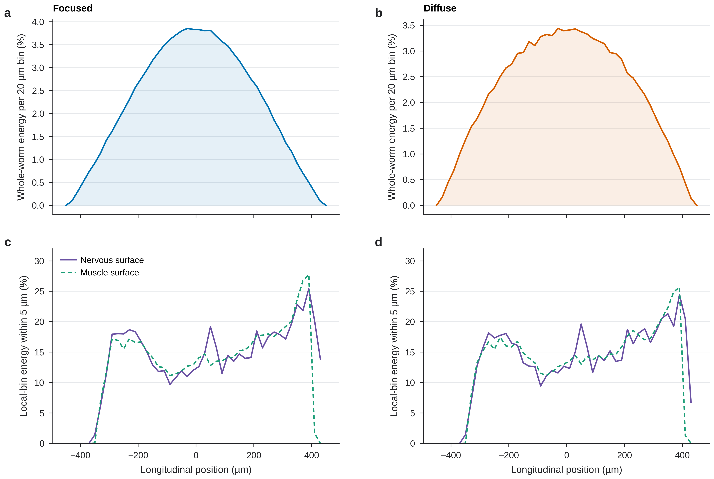
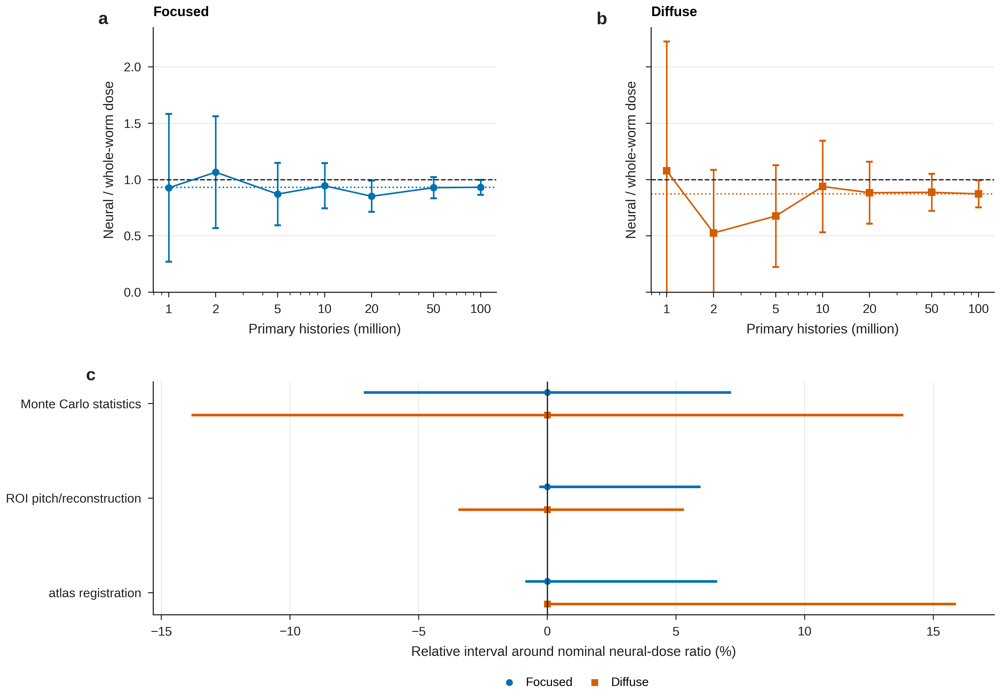

# Supplementary figures

**Supplementary Figure S1. Longitudinal deposited-energy distributions.** **a,b**, Whole-worm energy deposited in 20 µm longitudinal bins for focused and diffuse irradiation, expressed as a percentage of total whole-worm deposited energy. **c,d**, Deposited energy within 5 µm of nervous and muscle surfaces in the same bins, normalized to local whole-worm deposition. Raw bins are shown without smoothing. Zero-valued bins indicate positions with whole-worm deposition but no deposition within 5 µm of the reconstructed surfaces.

**Supplementary Figure S2. Statistical convergence and separated neural-dose uncertainty.** **a,b**, Neural-to-whole-worm dose ratio versus cumulative primary histories for focused and diffuse nominal simulations. Points are event-level estimates and whiskers are 95% Monte Carlo intervals; colored dotted lines are the final 100-million-history estimates, and the black dashed line denotes equality with whole-worm mean dose. **c**, Relative Monte Carlo 95% sampling interval, deterministic ROI-pitch range, and deterministic atlas-registration bracket around the nominal neural-dose ratio. These unlike uncertainty types are displayed separately and are not quadrature-combined. The experimental factor-of-two absolute-dosimetry interval is excluded because it scales absolute regional Gy rather than the regional transport ratio.
